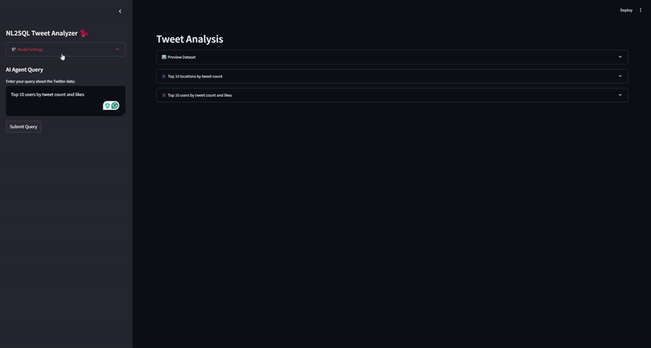

# 🐦 Twitter/X Political Posts Analysis  
### 🚀 USC HUMANS Lab Hackathon 2024


Welcome to my submission for the **USC HUMANS Lab Hackathon 2024**!  

This repository focuses on analyzing political tweets collected from Twitter/X, and demonstrates a pipeline to **extract**, **store**, **query**, and **analyze** the data. 

---

## 📸 Quick Glimpse

### Embedding and Clustering Demo

Below is a demo of the embedding and clustering experiment in action:


[▶️ Watch Video Demo](https://youtu.be/djjLpIrIrts?si=wY1LExkeourBbwUa)


### NL2SQL Agent Demo




---

## 💽 Database Download

Please download the tweets database from [this link](https://1drv.ms/u/c/ac38806cd085673a/EYVijis8DHlNiDeULP_IqwwBHA9bdCq5JOAm7BUBHMuBCA?e=P8G7Xv).
Once you download the database unzip it and place it in the root folder of the program.

---

## 🗂 Repository Contents

1.**`create_db.ipynb`**  
   - Responsible for extracting compressed tweet data and **saving** it into a SQL database. 

2. **`Analysis.ipynb`**  
   - A Jupyter Notebook demonstrating how to **explore** and **analyze** raw chunks of csv and tweets stored in the SQL database. 

3. **`nl2sql_agent/`**  
   - A folder containing an AI-powered agent that converts **natural language** queries into **SQL**.  
   - For setup and usage instructions, please read the dedicated `README.md` inside this folder.
   - For a detailed guide on installation and usage, head to the [`nl2sql_agent` folder](./nl2sql_agent/README.md).

4. **`embedding_and_clustering/`**
   - Interactive visualization tool for exploring tweet clusters using embeddings
   - Features:
     - Real-time embedding generation using Ollama models
     - Dynamic hierarchical clustering with adjustable parameters
     - Interactive 3D visualization of tweet clusters
     - Automatic cluster summarization and labeling
     - Caching system for faster subsequent runs
     - For detailed setup and usage, check the [`embedding_and_clustering` folder](./embedding_and_clustering/README.md).

5. **`Project Report.pdf`**  
   - A comprehensive **project report** outline describing the goals, approach, and potential future directions.

---

## 💡 How It Works

1. **Data Extraction**  
   Use `create_db.ipynb` to unpack the compressed tweets and insert them into a SQL database.
   
2. **Data Exploration**  
   Fire up `Analysis.ipynb` to explore trends, anomalies, or other interesting facets in the data.
   
3. **Natural Language Queries**  
   Interact with the `nl2sql_agent/` to seamlessly query the database using English prompts.

4. **Embedding & Clustering Analysis**
   - **Generate Embeddings**: Convert tweets into vector representations using Ollama models
   - **Cluster Formation**: Group similar tweets using k-means clustering
   - **Visualization**: Explore clusters in an interactive 3D space
   - **Insights**: 
     - Hover over points to read tweet content
     - View AI-generated cluster summaries
     - Adjust clustering parameters in real-time
     - Export findings for further analysis

---

## 🖥️ Running apps locally 

### 📋 Prerequisites
- Python 3.8 or higher
- Ollama installed and running locally
- At least one Ollama model downloaded (recommended: mistral or llama2)

### 🚀 Development Setup

#### 1️⃣ Create Virtual Environment
```bash
python -m venv venv
Activate the virtual environment
```

On macOS/Linux:
```bash
source venv/bin/activate
```
On Windows:
```bash
.\venv\Scripts\activate
```

#### 2️⃣ Install Dependencies
```bash
pip install -r requirements.txt
```
Install Jupyter kernel dependencies
```bash
pip install ipykernel jupyter
```

#### 3️⃣ Adding the virtual environment as a jupyter kernel.
```bash
python -m ipykernel install --user --name=venv
```

#### 4️⃣ Start Ollama Server
Ensure Ollama is running on your machine (default port: 11434)

#### 5️⃣ Launch the app
Navigate to either nl2sql or embedding_and_clustering folders via the terminal and run the following command
```bash
streamlit run app.py
```

---

## 🎯 Why This Matters

By cleaning and structuring large volumes of Twitter/X data, we can uncover:
- **Topic clusters** (political or otherwise).
- **Anomalies** or out-of-place chatter.
- **Sentiment trends** and **network relationships** among users.  

This approach offers a glimpse into how modern NLP and database management can help us **understand** and **visualize** online political discourse.

---

## 🫶 Notable Resources Utilizes:

- **Streamlit:** Ease creation of user interface.
- **Ollama:** For loading models and utilizing tool calling.
- **Plotly:** Interactive 3D visualization of tweet clusters.
- **scikit-learn:** Clustering and dimensionality reduction.
- **DuckDB:** Fast and easy to work with SQL database.
- **Clustering Tweets via Tweet Embeddings by Daniel X. Sun:** Great thesis on embedding tweets and related challenges.
- **Generative AI:** Portions of the code in this repo was generated using AI.

---
