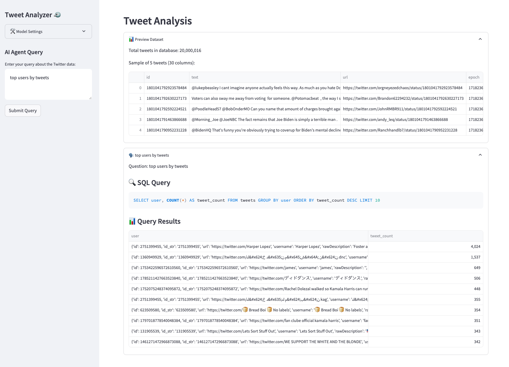

# 🐦 Twitter/X Political Posts Analysis  
### 🚀 USC HUMANS Lab Hackathon 2024

Welcome to my submission for the **USC HUMANS Lab Hackathon 2024**!  
This repository focuses on analyzing political tweets (and other thematically-adjacent content) collected from Twitter/X, and demonstrates a pipeline to **extract**, **store**, **query**, and **analyze** the data. 

---

## 📸 Quick Glimpse

Below is a snapshot of the NL2SQL agentic application in action:
Prompted to find top users by tweet count.

---

## 🗂 Repository Contents

1. **`Analysis.ipynb`**  
   - A Jupyter Notebook demonstrating how to **explore** and **analyze** tweets stored in the SQL database.
   
2. **`create_db.ipynb`**  
   - Responsible for extracting compressed tweet data and **saving** it into a SQL database.

3. **`nl2sql_agent/`**  
   - A folder containing an AI-powered agent that converts **natural language** queries into **SQL**.  
   - For setup and usage instructions, please read the dedicated `README.md` inside this folder.

4. **`scope.pdf`**  
   - A brief **project scope** outline describing the goals, approach, and potential future directions.

---

## 🤖 About the NL2SQL Agent

The **NL2SQL Agent** is an innovative tool that:
- Translates natural language into SQL queries on the fly.
- Executes those queries against the tweet database to quickly retrieve relevant information.
- Allows for rapid **exploratory data analysis** without writing raw SQL.

For a detailed guide on installation and usage, head to the [`nl2sql_agent` folder](./nl2sql_agent/README.md).

---

## 💡 How It Works

1. **Data Extraction**  
   Use `create_db.ipynb` to unpack the compressed tweets and insert them into a SQL database.
   
2. **Data Exploration**  
   Fire up `Analysis.ipynb` to explore trends, anomalies, or other interesting facets in the data.
   
3. **Natural Language Queries**  
   Interact with the `nl2sql_agent/` to seamlessly query the database using English prompts.

---

## 🎯 Why This Matters

By cleaning and structuring large volumes of Twitter/X data, we can uncover:
- **Topic clusters** (political or otherwise).
- **Anomalies** or out-of-place chatter.
- **Sentiment trends** and **network relationships** among users.  

This approach offers a glimpse into how modern NLP and database management can help us **understand** and **visualize** online political discourse.

---

